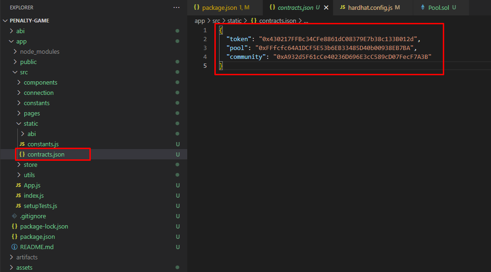
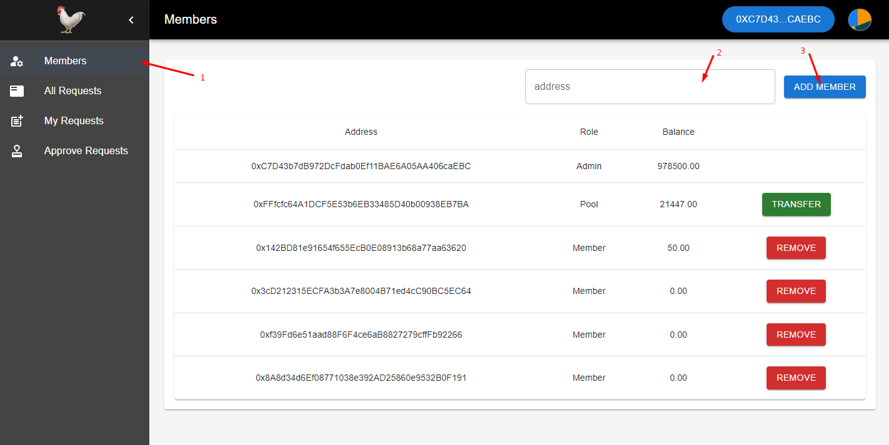
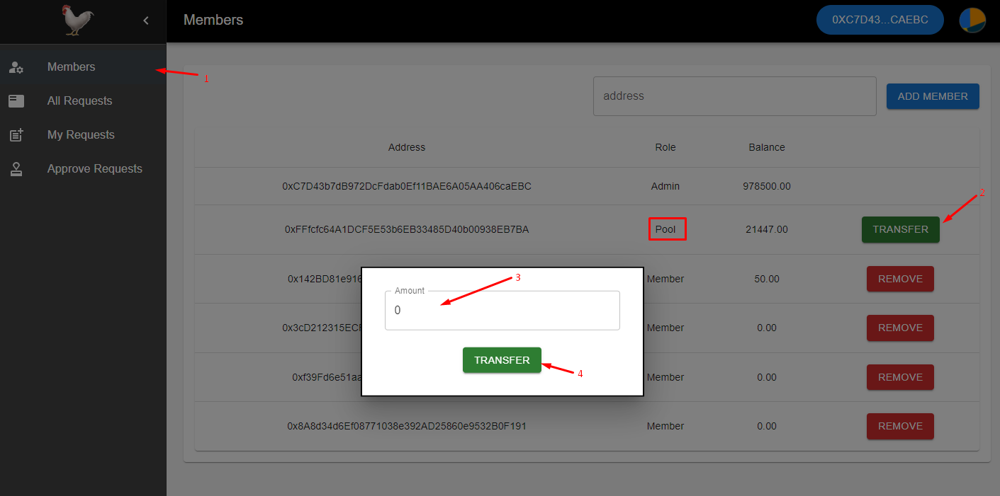
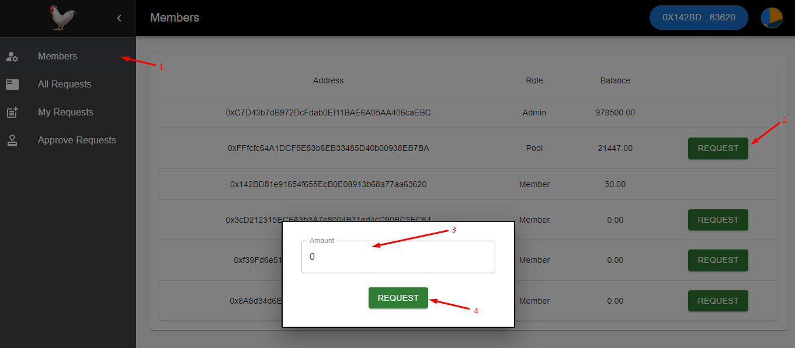
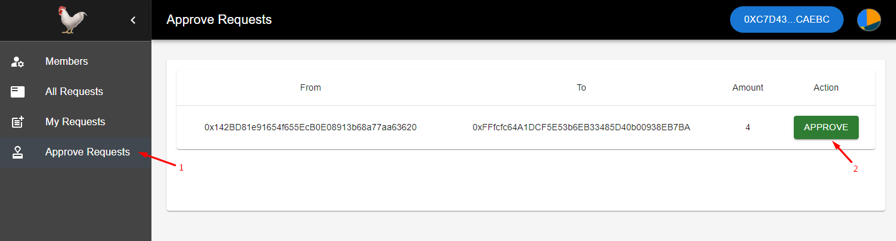
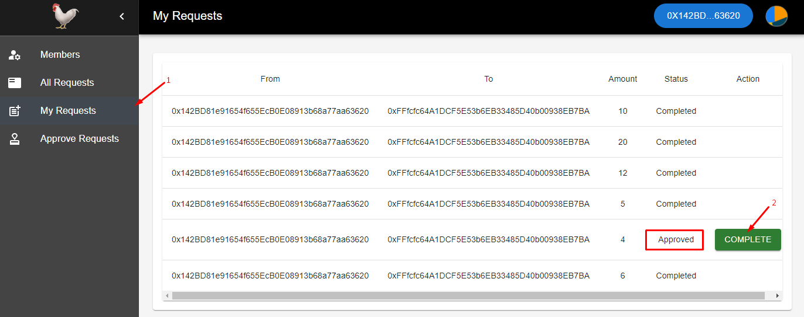

# Penalty Game

This is test task - penalty game project for Neitec company.

## Setup Environments


### Install
```shell
npm install
cd app
npm install
```
Please copy .env.example file and rename it to .env. And add wallet private key to DEPLOYER_KEY. And please install [metamask extension](https://chromewebstore.google.com/detail/metamask/nkbihfbeogaeaoehlefnkodbefgpgknn?hl=en-US&utm_source=ext_sidebar) on browser.


## Deployments

### Compile Smart Contract
```shell
npm run compile
```

### Test Smart Contract
```shell
npm run node
npm run test
```

### Deploy Smart Contract
```shell
npm run deploy-goerli
```

After deploying smart contracts, you can see the deployed contract addresses in ./app/src/static/contracts.json



## Run app

### Start App
```shell
npm start
```

## How to use this app (Admin)

### Add Member

1. Go to Members page.
2. Input wallet address for new member.
3. Click add member button.



### Remove Member

1. Go to Members page.
2. Click remove button.


### Transfer token to pool

1. Go to Members page.
2. Click Transfer button.
3. Input token amount on modal.
4. Click Transfer button on modal.




## How to use this app (Member)

### Request Transfer

1. Go to Members page.
2. Click Request button.
3. Input token amount on modal.
4. Click Request button on modal.




### Approve Request

1. Go to Approve Requests page.
2. Click Approve button to approve a request.



### Complete Request

1. Go to My Request page.
2. Click Complete button to complete a request.

